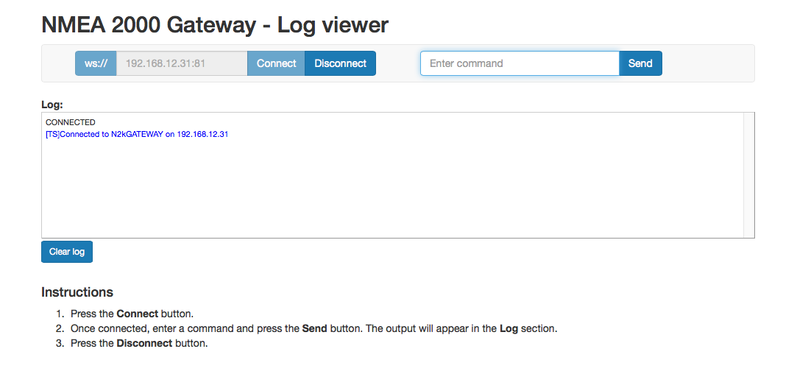

# NMEA2000 to WebSocket+Serial gateway 
Reads messages of N2K-bus and relaying over WebSocket and Serial 
### Functionality
- Listens for messages on NMEA 2000 (CANBus) bus and logs PGN of all messages received
- Writes same output over WebSocket and over Serial in Linux-'Tee'-like fashion (WebSocketBufferedStrem.h, inspired by [NeoTee](https://github.com/SlashDevin/NeoTee))
- Parses selected messages and logs
- Provides a simple yet (somewhat) responsive ([BootstrapV3](http://getbootstrap.com/)-based) web interface from the ESP8266 SPIFFS-filesystem
- Web-captive portal for configuration of WiFi-connecition
- Over-The-Air updates supported

### Dependencies
Depends on the following libraries (in addtion to the [`ESP8266 Core`](https://github.com/esp8266/Arduino) and [`Arduino IDE`](https://github.com/arduino/Arduino))
- [`arduinoWebSockets`](https://github.com/Links2004/arduinoWebSockets) - WebSocket Server and Client for Arduino
- [`CAN_BUS_Shield`](https://github.com/peppeve/CAN_BUS_Shield) - Can Bus Mcp2515 8/16 MHz oscillator 
- [`NMEA2000`](https://github.com/ttlappalainen/NMEA2000) - NMEA2000 library for Arduino 
- [`NMEA2000_mcp`](https://github.com/andreasberg/NMEA2000_mcp) - NMEA2000 library support for MCP2515 CAN bus controller. Forked version with added support for ESP8266 interrupts
- [`WiFiManager`](https://github.com/tzapu/WiFiManager) - ESP8266 WiFi Connection manager with web captive portal
- [`Arduino-Makefile-ESP`](https://github.com/andreasberg/Arduino-Makefile-ESP) - Arduino Makefile for ESP-boards 

### Building & flashing 

Edit the Makefile 
```make
  ARDMK_DIR := $(SRCDIR)/../Arduino-Makefile-ESP
  BOARD_TAG=huzzah
  ESP_OTA_ADDR=192.168.12.31
```
Then compile->link->hex
```sh
  make 
```
Normal upload (`esptool`) over USB-serial-FTDI 
```sh
  # first hit GPIO0+RST buttons on the Huzzah-board to enter flash-mode
  make upload 
  # sometimes the boot process hangs after upload, press RST to try again 
```
If the device for the USB-serial port in not detected correctly then override by defining MONITOR_PORT in Makefile
```make
  MONITOR_PORT=/dev/tty.usbserial-A104OFNV
```
A special target `monitor` in the makefile opens a screen-connection over serial
```sh
  make monitor
  # Ctrl-A k let's you terminate the serial connection
  # Connection needs to be terminated before 'make upload' or 'make upload_fs'
```
Once this (or any other sketch supporing Over-The-Air (OTA) updates) is successfully flashed, further uploads can be done with `espota.py` without putting board into flash-mode or closing serial connection(monitor)
Update Makefile:
```make
  ESP_OTA_ADDR=192.168.4.1
  ESP_OTA_PORT=8080           (default 8266)
  ESP_OTA_PWD=mysecret        (default <empty>)
```
and then
```sh
  make upload_ota
```
The webserver-files are located in [$(SRCDIR)/data](data) and the SPIFFS-file (filesystem binary image file) is created with makefile target `fs`
```sh
  make fs
```
and uploaded/flashed with
```sh
  make upload_fs
```
or
```sh
  make upload_fs_ota
```

After the board has booted and connected to Wifi, open a browser and go to `http://<IP>/index.html`

Default WebSocket-port is 81 so clicking 'Connect' shoud open the WebSocket-connection and start the feed of log-messages.




### Hardware

The ESP-module used is the [Adafruit HUZZAH ESP8266 breakout](https://learn.adafruit.com/adafruit-huzzah-esp8266-breakout/overview) with a "shield" providing
  - a CAN-bus interface (based on Microchip MCP2515- & MCP2562-ICs)
  - a switching regulator (based on Texas Instrument TPS54202-IC) for powering both the ESP8266-module and shield from the standard 12V supply of NMEA2000 bus

The schematic&board (EAGLE-)files can be found [here](hardware/esp8266_adafruit_huzzah_CAN_shield_with_Regulator)

Components of the shield are hand-solderable (minimum size 0705) but both the inductor (L1) and oscillator (Y1) are a bit tricky (should have a bit larger landing-pads)  

### ToDo/Limitations/Issues

- Implement more generic/lightwigth parse-to-log-function
  - The implementation for parsing the N2k messages is a simple rip of NMEA2000-library DataDisplay-examples and quite heavy. Only a few messages can be handled before exhausting the ESP8266's very limited .text-section (max 32 KB, linker error: section '.text' will not fit in region 'iram1_0_seg'). I assume the WiFiManager & arduinoWebSockets are also to blame for bloating the section. 
- Design shield version 2 for more cost effective ESP8266-modules like the Wemos D1 Mini 

